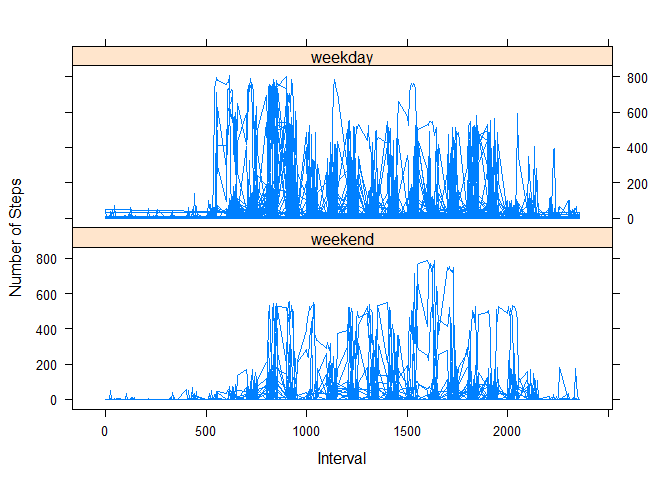

# Reproducible Research: Peer Assessment 1
Olaide Allibalogun  
March 14, 2016  


## R Markdown

This is an R Markdown document. Markdown is a simple formatting syntax for authoring HTML, PDF, and MS Word documents. For more details on using R Markdown see <http://rmarkdown.rstudio.com>.

When you click the **Knit** button a document will be generated that includes both content as well as the output of any embedded R code chunks within the document. You can embed an R code chunk like this:

## Loading and preprocessing the data


```r
activity <- read.csv("activity.csv", header = TRUE)
activity$date <-as.Date(activity$date)
library(lattice)
```
## 1. Total number of steps taken per day


```r
sumsteps <- aggregate(x=activity$steps, by=list(day=activity$date), FUN=sum)
```
## 2. Histogram of the total number of steps taken each day

```r
hist(sumsteps$x, xlab = "Total Steps per Day", ylab = "Frequency", 
    main = "Histogram of Total Steps taken per day", col="green")
```


## 3. Mean and median number of steps taken each day


```r
mean(sumsteps$x, na.rm = TRUE)
```

```
## [1] 10766.19
```

```r
median(sumsteps$x,na.rm = TRUE)
```

```
## [1] 10765
```

## 4.Time series plot of the average number of steps taken


```r
meansteps_interval <- aggregate(x=activity$steps, by=list(interval=activity$interval),na.rm= TRUE, FUN=mean)
```

```r
plot(meansteps_interval$interval, meansteps_interval$x,type = "l", xlab = "Time Intervals (5-minute)", 
    ylab = "Average number of steps taken", main = "Average Steps Taken at 5 minute Intervals", 
    col = "red")
```


b. Which 5-minute interval, on average across all the days in the dataset, contains the maximum number of steps


```r
meansteps_interval[which(meansteps_interval$x == max(meansteps_interval$x)), ]
```

```
##     interval        x
## 104      835 206.1698
```
##6. Code to describe and show a strategy for imputing missing data

a. total number of missing values in the dataset


```r
sum(is.na(activity$steps))
```

```
## [1] 2304
```
b. Duplicate activity dataset to create a dataset with the filled-in NA values

```r
activity_NA <- activity
```
c. Input NA values. Values were inputed by averaging the total number of steps per interval across all days and replacing the NAs with the mean value(by interval)

```r
for (i in which(is.na(activity_NA$steps))){
    activity_NA$steps[i] <- mean(activity_NA$steps[which(activity_NA$interval==activity_NA$interval[i])], na.rm = TRUE)
}
```
###Total number of steps taken per day after NA values was inputed


```r
sumstepsNA <- aggregate(x=activity_NA$steps, by=list(day=activity_NA$date), FUN=sum)
```
##7.Histogram of the total number of steps taken each day after missing values are imputed


```r
hist(sumstepsNA$x, xlab = "Total Steps per Day", ylab = "Frequency", 
    main = "Histogram of Total Steps taken per day", col="blue")
```


###Calculate mean and median of sumstepsNA

```r
mean(sumstepsNA$x)
```

```
## [1] 10766.19
```

```r
median(sumstepsNA$x)
```

```
## [1] 10766.19
```
##8. Panel plot comparing the average number of steps taken per 5-minute interval across weekdays and weekends

a. create factor levels weekday and weekend


```r
weekdays1 <- c('Monday', 'Tuesday', 'Wednesday', 'Thursday', 'Friday')
activity_NA$wDay <- factor((weekdays(activity_NA$date) %in% weekdays1), 
                   levels=c(FALSE, TRUE), labels=c('weekend', 'weekday'))
```


Plots of the 5-minute interval (x-axis) and the average number of steps taken, averaged across all weekday days or weekend days (y-axis)


```r
xyplot(steps~interval|wDay,data = activity_NA,type='l',layout=c(1,2),
     xlab='Interval',ylab='Number of Steps')
```




